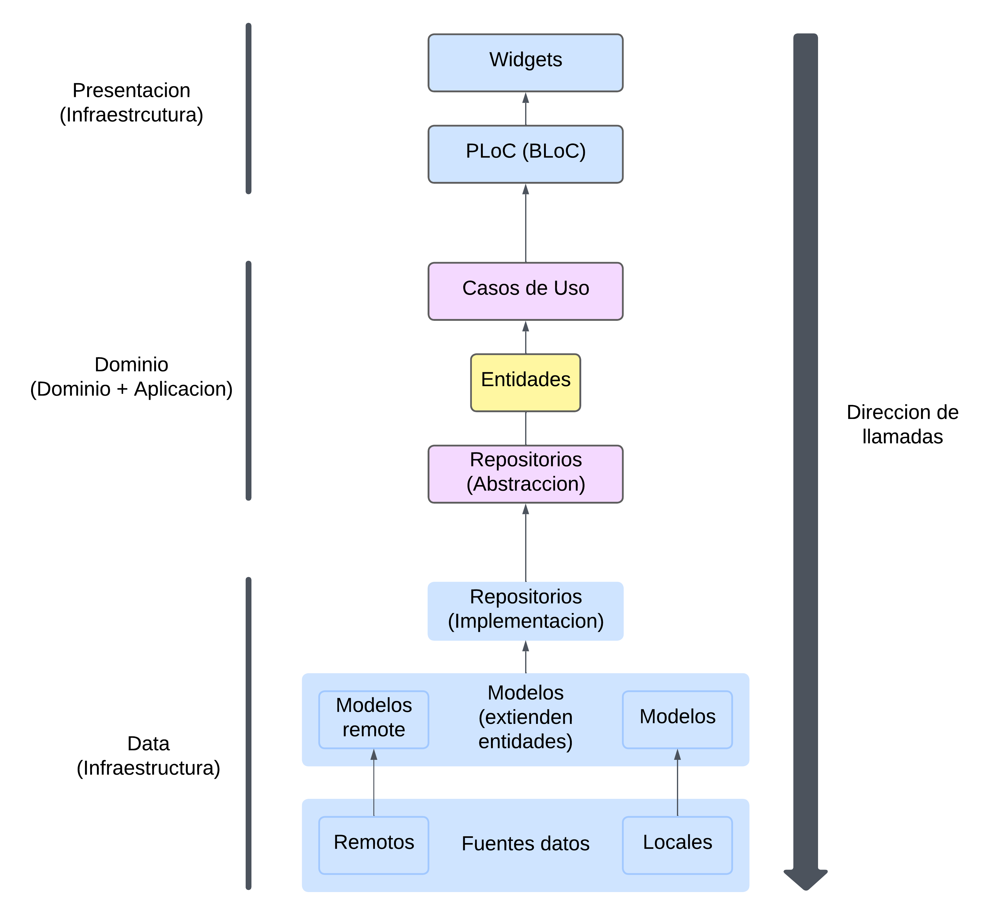

# streaming_front_app

Flutter project for a music streaming app, consuming the 'streaming-api'.

## Used architecture

The project seeks to use the architecture established by Reso Coder (*https://resocoder.com/2019/08/27/flutter-tdd-clean-architecture-course-1-explanation-project-structure/*) with some minors modifications based on some tohers sources as Flutter Guys (*https://www.youtube.com/watch?v=7V_P6dovixg*) and AbdulMuaz Aqeel (*https://devmuaz.medium.com/flutter-clean-architecture-series-part-1-d2d4c2e75c47*). The project is evolving so the architecture could change in the future based in some other authors.

### Architecture Diagram

## How to run

**Important:** the app is build in Android Tiramisu (API 33) and Flutter 3.13.9

1. Install dependencies from pubspec.yaml
2. Launch Android Emulator ()
3. Run `flutter run lib/main.dart` or click `Run` in VsCode
4. We hope you enjoy :D

## Util commands

- `dart run build_runner watch` for automated runner builder
- `dart run build_runner build` for one time build
