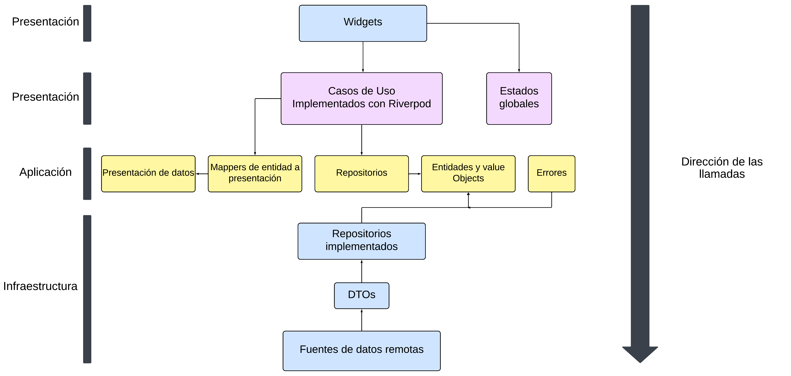
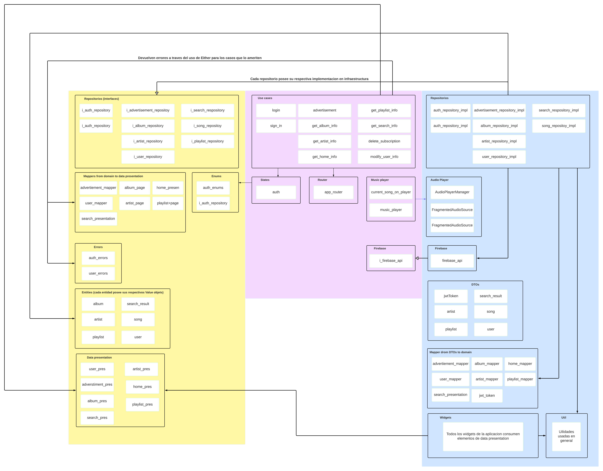

# Streaming app

Flutter project for a music streaming app, consuming the 'streaming-api'.

## Used architecture

The project seeks to use the architecture established by [Reso Coder](https://resocoder.com/2020/03/09/flutter-firebase-ddd-course-1-domain-driven-design-principles/) with some modifications based on some others sources as [Flutter Guys](https://youtu.be/7V_P6dovixg?si=0WcKiyCWNPymxgGZ), [AbdulMuaz Aqeel](https://devmuaz.medium.com/flutter-clean-architecture-series-part-1-d2d4c2e75c47) and Petros Efthymiou on his book Clean mobile Architecture.

### Architecture Overview Diagram

### Architecture Overview Diagram

[Full diagram here ](https://lucid.app/lucidchart/cbad860d-7bc1-4f19-9395-d68ed5985418/edit?viewport_loc=-1626%2C-4568%2C7603%2C6212%2C0_0&invitationId=inv_d488204c-2be8-4240-83ce-38d173dea83b)

## Main dependencies

- [Riverpod](https://riverpod.dev/)
- [Flutter hooks](https://pub.dev/packages/flutter_hooks)
- [Freezed](https://pub.dev/packages/freezed)
- [Get it](https://pub.dev/packages/get_it)
- [Injectable](https://pub.dev/packages/injectable)
- [Dio](https://pub.dev/packages/dio)
- [Firebase messaging](https://firebase.google.com/docs/cloud-messaging?hl=es)
- [Go router](https://pub.dev/packages/go_router)
- [Local storage](https://pub.dev/documentation/localstorage/latest/)
- [Logger](https://pub.dev/packages/logger)

## How to run the project

**Important:** the app is build in Android Tiramisu (API 33) and Flutter 3.13.9

1. Install dependencies from pubspec.yaml run `flutter pub get` on parent folder
2. Launch Android Emulator
3. Run `flutter run lib/main.dart`
4. We hope you enjoy :D

**If using VsCode with the dart extension** open the project, the download of the dependencies should start automatic, when finished select the device to play app on and click "run" on the file "main.dart" that is above line `void main()` .

## Util commands for development

- `dart run build_runner watch` for automated runner builder
- `dart run build_runner build` for one time build
